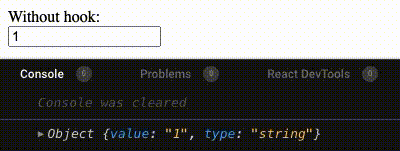
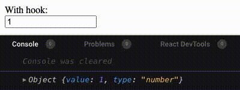

# use-controlled-input-number

*React hook to turn numeric input behavior into pretty much what you expect*

While it is not obvious at first glance, numeric inputs are not simple. Especially if you want to use the value that is typed in to calculate something, since **they return a string instead of a number**.

This hook is intended to solve this problem in the easiest possible way, giving you all the control over the input, but making it behave as you would expect (always returning a number).

<div align="center">
  <table border="0" cellspacing="0" cellpadding="0">
    <tbody>
      <tr>
        <td>
          
        </td>
        <td>
          
        </td>
      </tr>
    </tbody>
  </table>
</div>

> You can find these examples in [codesandbox](https://codesandbox.io/s/example-1-d0fny?file=/src/App.js)

## Installation

```bash
yarn add use-controlled-input-number
```

## Usage

This is an example of use for this hook:

```javascript
function ControlledInput () {
  const [value, setValue] = useState(1)

  const inputProps = useControlledInputNumber({
    value, // The value will always be of type number
    onChange: setValue
  })

  return (
    <input type='number' {...inputProps} />
  )
}
```

## Related projects

- [use_stepper](https://github.com/wKovacs64/use-stepper): If you want a hook that fully control the behavior of the input.

